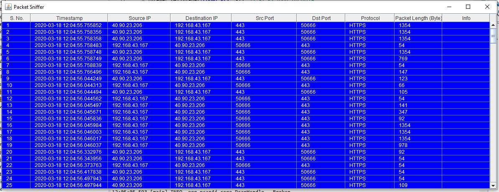

# JSniffer
Java packet sniffing tool -> 
It captures packets on network interface for a given time (sec) provided as argument & displays the basic info about the packet in Java Table GUI.

Example use of `pcap4j` libraries.

## Generated GUI:

Following external libararies are required:

    pcap4j-distribution-1.7.2-bin\pcap4j-packetfactory-static-1.7.2.jar
    pcap4j-packetfactory-propertiesbased-1.7.2.jar
    logback-classic-1.0.0.jar
    logback-core-1.0.0.jar
    slf4j-api-1.7.12.jar
    pcap4j-core-1.7.2.jar
    jna-4.1.0.jar

